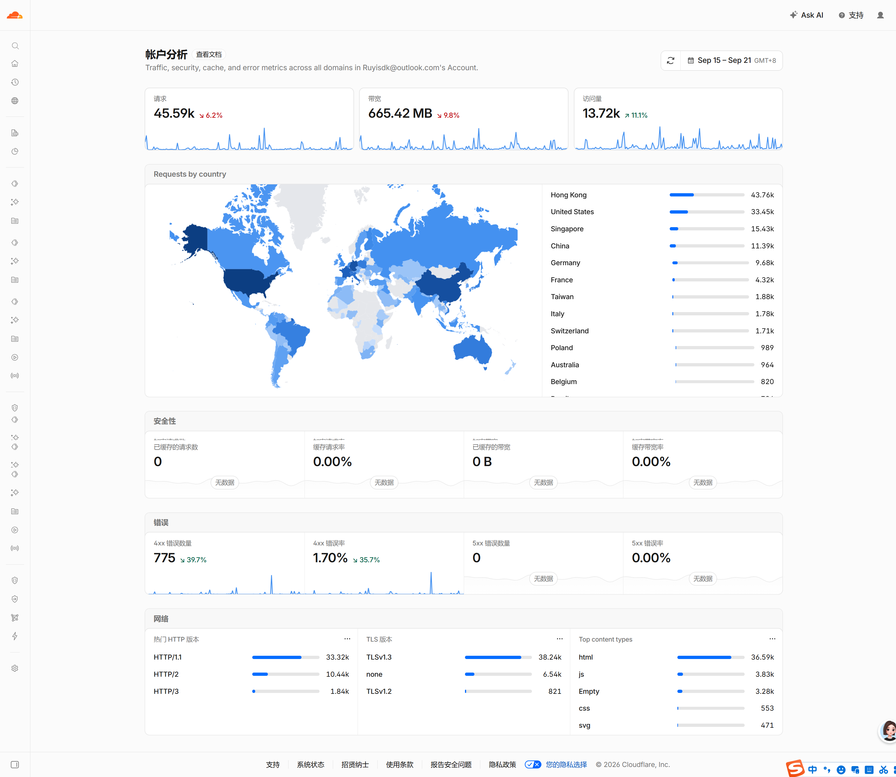
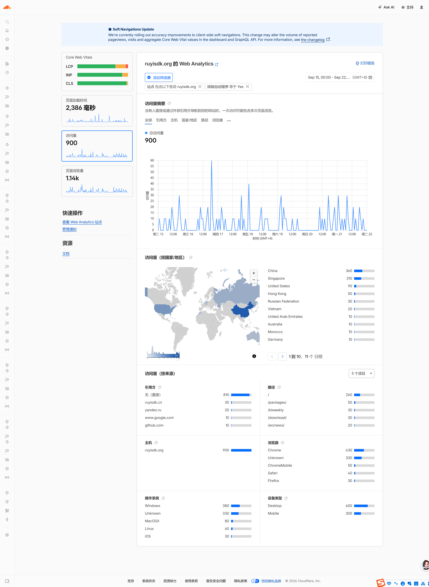
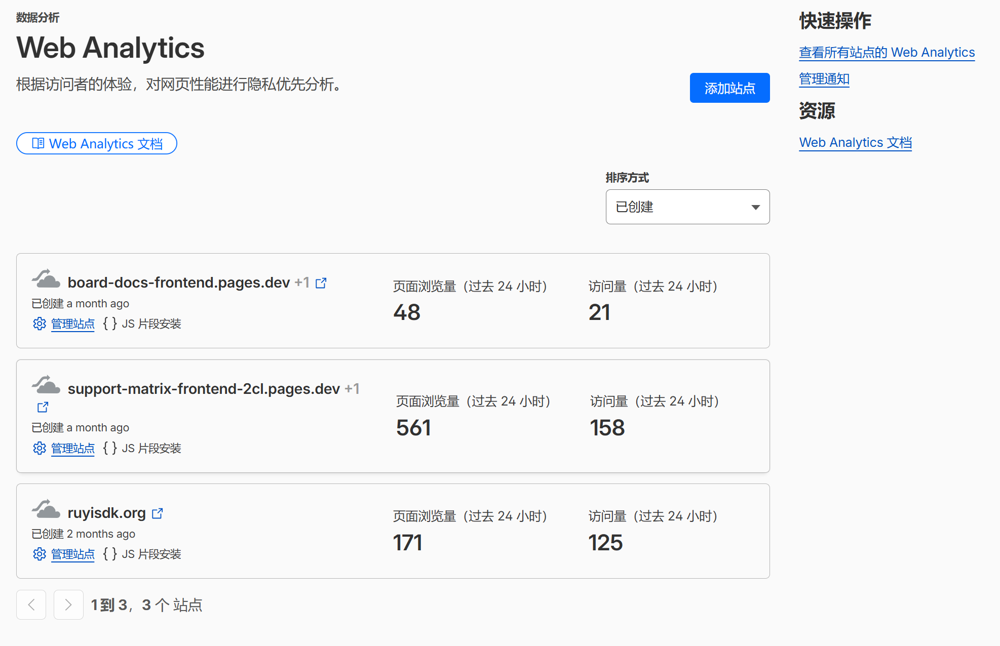

# Clouldflare web 访问量采集和归档

自动采集 RuyiSDK 相关站点在 Cloudflare 上的流量统计数据（账户分析 + Web Analytics），归档为结构化 JSON 与累计 CSV，供后续报表与趋势分析使用。

- **数据源 1 — 账户分析（GraphQL `httpRequestsAdaptiveGroups`）**：整个账户的 HTTP 请求数、访问量、流量，按国家/主机细分。
- **数据源 2 — Web Analytics（GraphQL `rumPageloadEventsAdaptiveGroups`）**：三个站点的页面浏览量、访问量，按来源/国家/路径/设备等 5 个维度细分。

采集频率：

- 每周二（周报）+ 每月 1 日（月报），由 GitHub Actions 定时触发；
- 也支持手动触发补采任意历史窗口（受数据源保留期约束，见下文）。


## 目录结构

```
仓库根目录/
├── .github/workflows/cf-stats.yml   
|       ├── cf-stats.yml             # 主 Workflow ，定时触发或者手动触发
|       └── cf-introspect.yml        # 前期测试用：Cloudflare GraphQL Introspect
|
└── cf-stats/
        ├── cf_stats.py              # 采集脚本（唯一的核心代码）
        ├── cf_report.mjs            # 截图 + PDF（需 playwright）:废弃，因为Cloudflare有真人验证自动化无得到的截图是验证真人界面
        ├── package.json             # Node 依赖声明
        ├── .gitignore               # 忽略 node_modules
        ├── results-weekly/          # 周报产物（自动生成并提交回仓库）
        │   ├── cf_weekly.csv        #   周度累计表（所有周追加在同一文件）
        │   └── 20260922/            #   以窗口结束日命名的目录，每期一个
        │       ├── _meta.json                          # 内部衔接文件(供 cf_report.mjs 消费的元信息)
        │       ├── ruyisdk@outlook.com_20260922.json   # 账户分析原始数据
        │       ├── ruyisdk.org_20260922.json           # ruyisdk.org 站点 RUM 原始数据（5 维细分）
        │       ├── support-matrix_20260922.json        # support-matrix 站点 RUM 原始数据（5 维细分）
        │       ├── board-docs_20260922.json            # board-docs 站点 RUM 原始数据（5 维细分）
        │       |
        │       ├── ruyisdk@outlook.com_20260922.png                 # 账户分析整页截图
        │       ├── ruyisdk.org_visits_20260922.png(pdf)             # 访问量截图或者打印报告
        │       ├── ruyisdk.org_pageloads_20260922.png(pdf)          # 页面浏览量截图或者打印报告
        │       ├── support-matrix_visits_20260922.png(pdf) 
        │       ├── support-matrix_pageloads_20260922.png(pdf) 
        │       ├── board-docs_visits_20260922.png(pdf) 
        │       └── board-docs_pageloads_20260922.png(pdf) 
        |
        ├── results-monthly/         # 月报产物（结构同上）
        │   ├── cf_monthly.csv
        │   └── 202608/              # 月报目录以数据所属月命名
        └── README.md
```

> results-weekly 和 results-monthly 是执行后的输出结果，通过提交到仓库的方式进行结果保存。
> json格式的数据是必须的输出，而 png 或者 pdf 等图形化的数据展示方式可选（目前不太好实现，需要人工干预）

### 各文件用途

| 文件                                   | 用途                                                                                                      |
| -------------------------------------- | --------------------------------------------------------------------------------------------------------- |
| `cf_stats.py`                        | 计算统计窗口 → 调 Cloudflare GraphQL/REST 拉数 → 写 JSON + CSV + meta                                   |
| `cf_stats.yml`                       | 定时（周二/每月1日北京时间早上）+`workflow_dispatch` 手动触发；负责解析输入日期、校验格式、注入环境变量 |
| `cf_weekly.csv` / `cf_monthly.csv` | 累计数据表：表头下第一行是 TOTAL 求和行，其余每期一行，按 A 列窗口幂等去重                                |
| 各期 JSON                              | 原始数据存档，粒度比 CSV 细（多维 breakdown），报表脚本直接消费                                           |
| `_meta.json`                         | 本期窗口、各数据源实际数据范围、siteTag 映射，供下游 `cf_report.mjs` 使用                               |

### CSV 列定义（与腾讯文档「web统计数据」A~I 列对齐）

| 列                          | 含义                                                  | 口径                                 |
| --------------------------- | ----------------------------------------------------- | ------------------------------------ |
| A_时间窗口                  | 行标识，`YYYYMMDDHHMMSS-YYYYMMDDHHMMSS`（北京时间） | **请求窗口**（见下文设计说明） |
| B_账户请求数 / C_账户访问量 | 账户分析                                              | 实际范围见 `account_window_utc` 列 |
| D~I 列                      | 三站点的访问量 / 页面浏览量                           | 实际范围见 `rum_window_utc` 列     |
| collect_date                | 本次采集运行的日期                                    | 与数据窗口无关                       |
| window_utc_start / end      | 请求窗口的 UTC 边界                                   |                                      |
| account_window_utc          | 账户数据**实际**覆盖的 UTC 范围                 | 与请求窗口可能不同                   |
| rum_window_utc              | RUM 数据**实际**覆盖的 UTC 范围                 | 与请求窗口可能不同                   |

---

## 如何运行

### 方式一：GitHub Actions（推荐，常规采集）

定时自动运行，无需干预。手动触发：仓库 → Actions → 选择本 workflow → **Run workflow**：

| 表单项              | 周报                                     | 月报                                                            |
| ------------------- | ---------------------------------------- | --------------------------------------------------------------- |
| 统计周期            | `weekly`                               | `monthly`                                                     |
| 起始日期 / 结束日期 | 都**留空** = 最近一个周二往前 7 天 | 都**留空** = 上月整月                                     |
| 补采历史窗口        | 都填，如 `20260818` / `20260825`     | 都填，起始填**当月 1 日**，如 `20260801` / `20260901` |

注意：两个日期必须**同时填写或同时留空**；月报起始日期务必填 1 日（输出目录按起始日期的年月命名）。
运行成功后结果自动 commit 回本仓库（`[skip ci]`，不会触发连锁构建）。

### 方式二：本地运行（调试、精确时间戳补采）

```bash
export CF_API_TOKEN='你的token'        # 用单引号，防止 shell 特殊字符破坏 token
export CF_ACCOUNT_ID='你的account_id'
# 常规周报（最近周二口径）
python3 cf_stats.py --period weekly
# 补采指定周
START_DATE=20260915 END_DATE=20260922 python3 cf_stats.py --period weekly
# 补采指定月
START_DATE=20260801 END_DATE=20260901 python3 cf_stats.py --period monthly
# 精确时间戳补采（CI 不支持，仅本地；用于账户保留期边缘的窗口）
START_TS=2026-08-22T17:00:00Z END_DATE=20260825 python3 cf_stats.py --period weekly
```

- 环境变量：`CF_API_TOKEN`、`CF_ACCOUNT_ID` 必需；
- `START_DATE` / `END_DATE`（格式 `YYYYMMDD`，北京时间）可选；
- `START_TS`（ISO8601 时间戳）可选，优先级高于 `START_DATE`。
- 本地产物默认提交回仓库备份（`git add cf-stats && git commit && git push`）。

---

## 设计说明

### 1. 两个数据源的保留期不一致 — 核心约束

| 数据源        | 保留期（滚动窗口）                                         | 说明                             |
| ------------- | ---------------------------------------------------------- | -------------------------------- |
| 账户分析      | **约 32 天**（官方报错口径 `4w4d`）                | 超过就只能拿到报错，数据永久丢失 |
| Web Analytics | **更长，约 180 天**（界面观测最早可选到 2026-03-28） | 同样的窗口几乎总能全量取到       |

这意味着：
同一个历史窗口，账户数据可能已经拿不全甚至拿不到，而站点数据依然完整。
任何「一刀切」的时间校验都会导致要么站点数据被白白放弃、要么账户查询直接报错中断。

### 2. 请求窗口 vs 实际数据窗口

- **请求窗口（requested window）**：用户/工作流输入的时间范围，是「需求口径」。
- **实际数据窗口（actual window）**：每个数据源真实覆盖的范围。当请求起点早于某源保留期时，该源起点被**自动夹取（clamp）**到保留线；窗口完全出界时该源按 0 值**降级**。
  原则：**输入窗口是需求，不是硬性保证；每个数据源在窗口内各取所能拿到的最大范围。**

体现在输出中：

- CSV 的 A 列 = 请求窗口（见第 3 点）；`account_window_utc` / `rum_window_utc` 两列分别记录两个源的**实际**范围，口径不混淆。
- JSON 中同时有 `requested_window_local` 与 `window_local`，以及 `window_clamped`（被夹取）/ `window_degraded`（完全出界降级）两个布尔标记。

### 3. CSV 行标识为什么用请求窗口

账户的保留线随时间滚动（`现在 − 32天`），若用夹取后的时间做行标识，同一期补采两次会得到两行不同标签的「同一期」，破坏幂等并产生重复。因此：

- **A 列固定用请求窗口** → 同一期重跑原地覆盖，幂等；相邻期严格首尾相接。
- 账户/RUM 的实际范围写在行尾两列，报表按各自口径解读。

### 4. 边界自动处理策略（三层防线）

程序自动识别时间边界，**边界问题永远不中断采集，只有真错误（token 失效、网络、权限）才硬失败**：

1. **预夹取**：查询前按各源已知保留期把起点/终点夹到可查范围（起点留 10 分钟余量防压线；终点夹到当前时刻防未来空段）。
2. **动态修正**：若真实保留期与预估值不符，从 Cloudflare 的 quota 报错消息（`cannot request data older than 4w4d`）中解析出实际天数，自动重夹取重试一次。
3. **降级**：某源窗口完全出界时该源按 0 值输出并明确标记，另一源照常执行。

### 5. 口径与对齐约定

- 所有窗口为 **北京时间、左闭右开** `[start, end)`，周报 = 上周二 00:00 ~ 本周二 00:00，
  月报 = 上月 1 日 00:00 ~ 本月 1 日 00:00；相邻期首尾相接、不重叠，TOTAL 求和即全量。
- 账户数据过滤 `requestSource:"eyeball"`（仅真实访客，剔除爬虫/预取）。
- RUM 指标为 页面浏览量（pageloads/count）与 访问量（visits）。

### 6. 数据可回溯范围与补采实践

以 2026-09 下旬为例（保留线滚动前移，请按实际运行日推算）：

- **2026-03-28 之后**：站点数据（D~I 列）均可完整补采；账户数据（B/C 列）只能补最近 ~32 天，更早的自动降级为 0 并标注。
- **重要**：账户数据超出保留期后**永久丢失**，因此关键期的补采要尽早执行——每多等一天，能补到的账户数据就少一天。
- 补采月报时起始日期填该月 1 日；同一期不要在夹取线移动后反复重跑账户残窗期（行标识幂等会覆盖，但账户可取范围只会越来越小）。

### 7. 已知限制

- CI 的手动触发只支持日粒度日期；精确到秒的边缘补采请本地用 `START_TS`。
- 账户残窗期的 B/C 列口径短于请求窗口，做趋势分析时请结合 `account_window_utc` 列或以 RUM 口径为准。
- 若 Cloudflare 调整保留期口径，脚本会通过报错解析自动适应，无需改代码；但预夹取常量（`RETENTION_DAYS`）可在脚本头部按需更新以减少一次失败重试。

---

# 改进需求

原本计划的需求，输出结果还包括截图，但是经过尝试，由于 Cloudflare 有真人验证，因此自动化截图得到截图是验证真人界面，而非统计数据展示页面。
后续将考虑本地半自动化方式是否有合适/省人工的方案。

参考：https://dash.cloudflare.com/  真实页面，截图效果如下：




ruyisdk.org 的访问量和页面加载量：



另外两个网站同 ruyisdk.org 一样，需要访问量和页面加载量：
